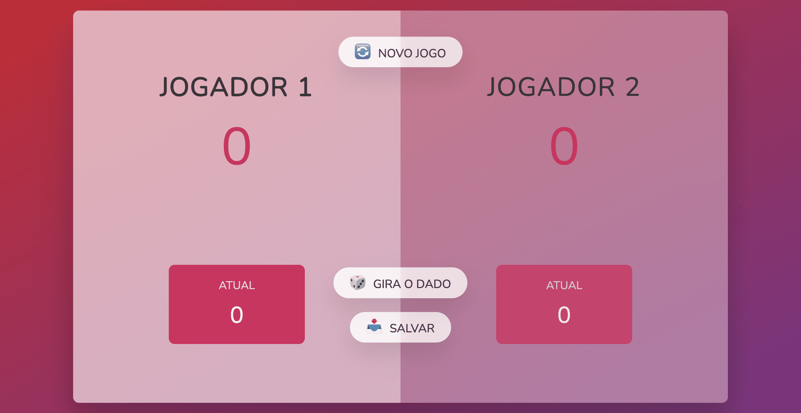

# Jogo gira o dado

## Habilidades
- Manipulação de DOM 
- Lógica de programação

Este jogo é simples mas divertido se jogar com a pessoa certa.

## Como jogar:

O jogo sempre inicia com o jogador 1 por isso tem a tela mais clara (Jogador a jogar terá sempre a parte da tela mais clara)
Ao clicar em “GIRA O DADO” você acumula pontos na zona ATUAL, esses pontos podem ser salvos na pontuação do jogador se clicar em “SALVAR” e passará a jogada para o proximo jogador.

Quando for a sua vez, pode girar quantas vezes quiser mas atenção ao número de azar que é o número 1 no dado, o número 1 passa a jogada para o proximo jogador e perde os pontos que estiver na zona ATUAL.

Ganha o jogo quem chegar a 100 pontos primeiro.

#### Pode testa-lo aqui: [gira-dado-monteiro](https://gira-dado-monteiro.netlify.app/)

Divirta-se :)

### Preview

